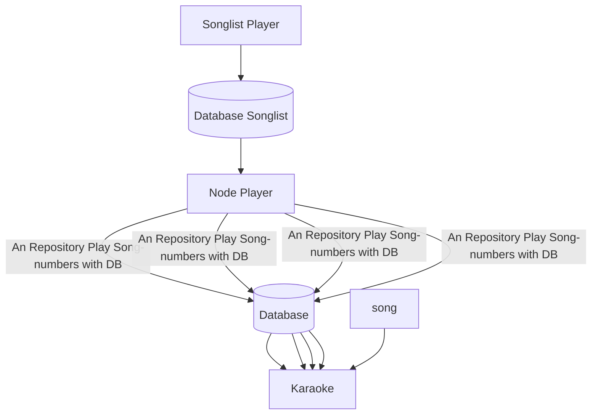

```mermaid
graph TD;
database[(Database Songlist)]
Songlist[Songlist Player]-->database-->Node[Node Player]--An Repository Play Song-numbers with DB-->db[(Database)] & db & db & db-->Karaoke
song-->Karaoke
```
